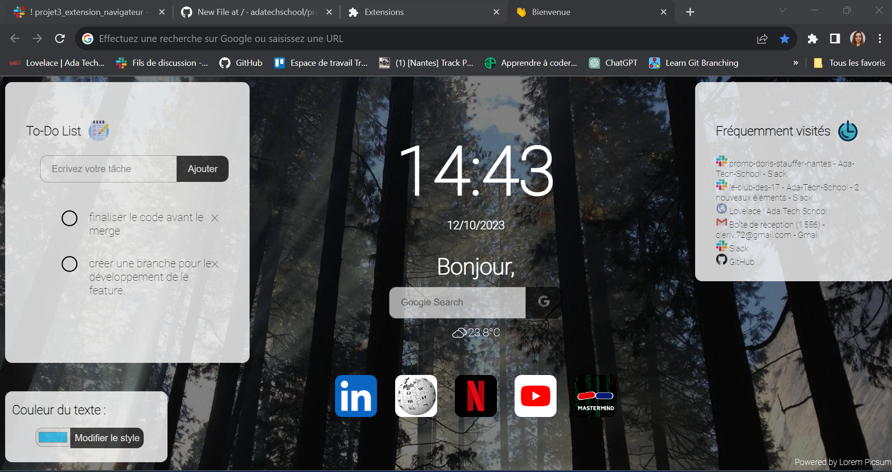
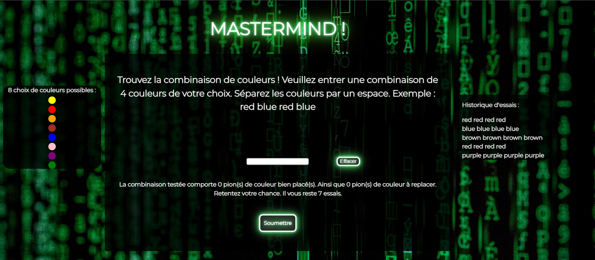

# Projet-Extension-de-Navigateur

Création d'une extension de navigateur (chrome) permettant de personnaliser les nouveaux onglets dès leurs ouvertures pour afficher une page d'accueil. 

Techno :
manifest V3
HTML
CSS
JS

Les différentes fonctionalités mises en place sont les suivantes : 
- Affichage de la date et de l'heure mise à jour automatiquement toutes les secondes.
- Affichage des données météo lié à l'appel d'une API météo et d'une API de géolocalisation.
- Mise à jour du back-ground au rafraîchissement de la page.
- Développement d'une To-Do-List avec sauvegardes des tâches en cours en localstorage.
- Appel API permettant l'affichage des sites les plus consultés par l'utilisateur.
- Développement d'un mini-jeu Mastermind accessible depuis la page d'accueil.

     
